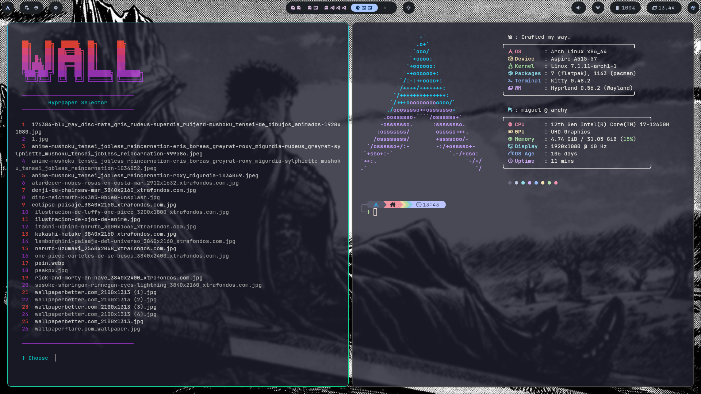
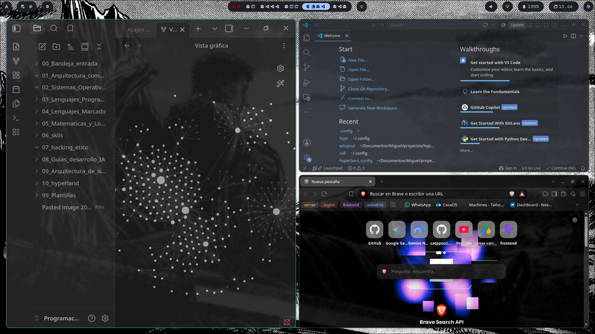
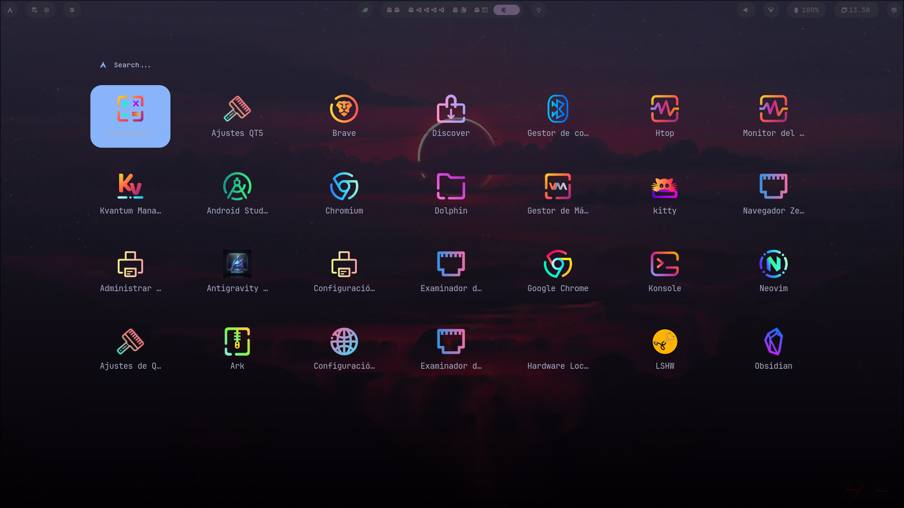
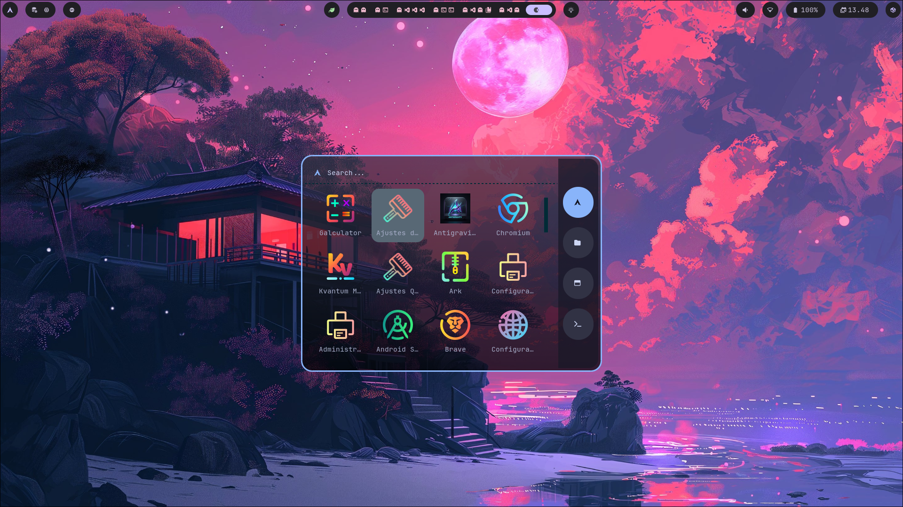
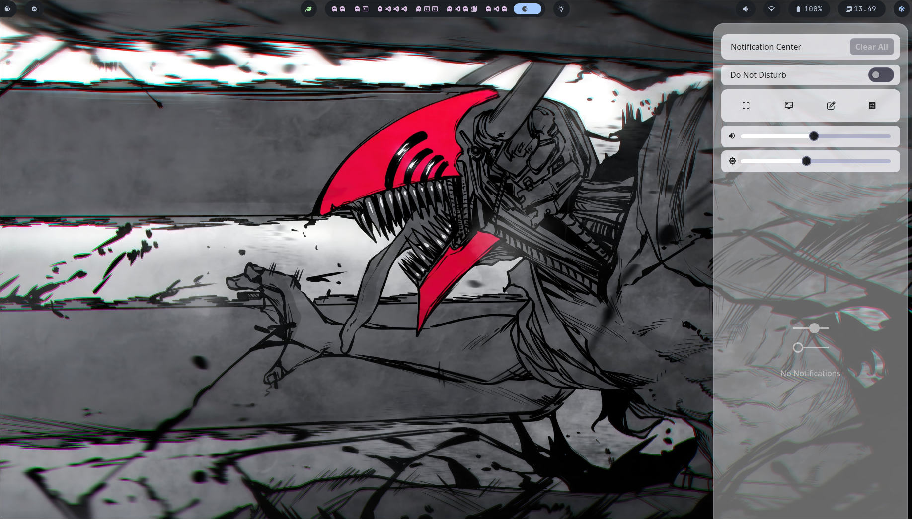

# 🌌 Dotfiles - Arch Linux & Hyprland

Bienvenido a mi entorno de trabajo. Esta configuración está diseñada para priorizar la eficiencia, la velocidad y una estética oscura y minimalista. Construido sobre **Arch Linux** con el compositor **Hyprland** (Wayland), optimizado para el desarrollo backend y el manejo ágil de ventanas.

---

## 🛠️ Especificaciones Técnicas

| Componente | Herramienta |
| :--- | :--- |
| **OS** | Arch Linux |
| **Window Manager** | Hyprland (Wayland) |
| **Terminal** | Kitty |
| **Shell & Prompt** | Zsh + Starship |
| **Barra de Estado** | Waybar |
| **Lanzador de Apps** | Rofi (Modo Launchpad) |
| **Notificaciones** | SwayNC |
| **Gestor de Archivos** | Dolphin (Kvantum/Qt6ct) |
| **Menú de Apagado** | wlogout |
| **Fuente** | JetBrainsMono Nerd Font |
| **Tema General** | Catppuccin Mocha |
| **Íconos** | Candy |

---

## ⌨️ Atajos de Teclado Principales (Keybindings)

Mi flujo de trabajo se basa fuertemente en la tecla `ALT`. Aquí están las invocaciones más importantes:

### Sistema y Utilidades
| Atajo | Acción |
| :---: | :--- |
| `ALT + T` | Abrir Terminal (Kitty) |
| `ALT + R` | Abrir Lanzador de Aplicaciones (Rofi) |
| `ALT + E` | Explorador de Archivos (Dolphin) |
| `ALT + B` | Navegador Web (Brave) |
| `ALT + O` | Obsidian (Gestión de Conocimiento) |
| `ALT + P` | Editor de Código (VS Code) |
| `ALT + N` | Tablón de Notificaciones (SwayNC) |
| `ALT + Z` | Historial del Portapapeles (Cliphist) |
| `ALT + BackSpace` | Menú de Apagado Elegante (wlogout) |

### Gestión de Ventanas (Hyprland)
| Atajo | Acción |
| :---: | :--- |
| `ALT + C` | Cerrar ventana actual |
| `ALT + V` | Modo Flotante (Despega la ventana de la cuadrícula) |
| `ALT + K` | Modo Pseudo (Mantiene una ventana pequeña pero confinada) |
| `ALT + J` | Alternar división de pantalla (Horizontal/Vertical) |
| `ALT + S` / `ALT + Shift + S` | Traer ventana oculta / Enviar a Special Workspace (Magic) |
| `ALT + Flechas` | Mover el foco entre ventanas (Izquierda/Derecha/Arriba/Abajo) |
| `ALT + Números (0-9)` | Navegar entre espacios de trabajo |
| `ALT + Shift + Números` | Mover la ventana actual a otro espacio de trabajo |
| `ALT + Clic Izquierdo` | Arrastrar y mover ventana flotante |
| `ALT + Clic Derecho` | Redimensionar ventana flotante |

---

## 👆 Gestos del Touchpad (libinput-gestures)
* **Deslizar 3 dedos:** Navegación entre espacios de trabajo.
* **Deslizar 4 dedos hacia abajo:** Abre el menú de aplicaciones a pantalla completa.

## ⚙️ Tecnologías y Herramientas

El motor detrás de este entorno es una combinación de herramientas modernas para Wayland:

* **Gestor de Ventanas:** [Hyprland](https://hyprland.org/) 
* **Terminal:** [Kitty](https://sw.kovidgoyal.net/kitty/)
* **Prompt:** [Starship](https://starship.rs/)
* **Lanzador (App Launcher):** [Rofi](https://github.com/davatorium/rofi) (Wayland fork)
* **Barra de Estado:** [Waybar](https://github.com/Alexays/Waybar)
* **Gestor de Notificaciones:** [SwayNC](https://github.com/ErikReider/SwayNotificationCenter)
* **Menú de Apagado:** [wlogout](https://github.com/ArtsyMacaw/wlogout)
* **Gestor de Archivos:** Dolphin (estilizado con Kvantum y qt6ct)
* **Paleta de Colores:** [Catppuccin Mocha](https://github.com/catppuccin/catppuccin)
* **Fuente:** JetBrainsMono Nerd Font

---

## 🤝 Créditos y Reconocimientos

* **Comunidad Catppuccin:** utilizada para algunos colores y el diseño de Dolphin
* **Comunidad de Hyprland:** Por los incontables repositorios de *dotfiles* que sirvieron como inspiración y material de estudio para la lógica de los atajos y el diseño de Waybar.
* **haikal-hakim:** Inspiracion tomada de https://github.com/haikal-hakim/athena.git para la waybar y la terminal 